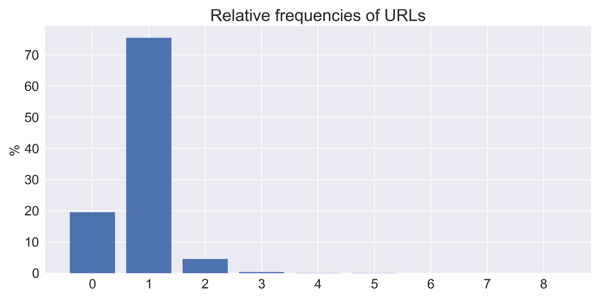

# Documentation

Some introductory sentence(s). Data set and task are relatively fixed, so 
probably you don't have much to say about them (unless you modifed them).
If you haven't changed the application much, there's also not much to say about
that.
The following structure thus only covers preprocessing, feature extraction,
dimensionality reduction, classification, and evaluation.

---

## Evaluation

### Design Decisions

Which evaluation metrics did you use and why? 
Which baselines did you use and why?

### Results

How do the baselines perform with respect to the evaluation metrics?

### Interpretation

Is there anything we can learn from these results?

---

## Preprocessing

In the following we describe all preprocessing steps that we have implemented. 

### Language filter

The language filter can be used to remove tweets from the data set that are in a different language than the target language.

####  Design Decisions

Since not all tweets in the dataset are written in English we had to decide whether we remove or translate them.
To decide which option to choose, we took a look at the language distribution of the tweets.

| Place | Language id | Number of tweets |
| ----: | ----------- | ---------------: |
| 1.    | EN          | 283.240           |
| 2.    | ES          | 3.492             |
| 3.    | FR          | 3.287             |
| 4.    | DE          | 811              |
| 5.    | IT          | 748              |
| 6.    | IN          | 631              |
| 7.    | UND         | 546              |
| 8.    | NL          | 396              |
| 9.    | PT          | 389              |
| 10.   | TL          | 362              |

As the majority of our tweets are english tweets, we decided to remove the non-english tweets.
We had two possibilities to do so. 
First, we could use the column `language` from the dataset. 
Second, we could use some external service or class to determine the language from the `tweet` column.
Although we have found that the language in the `language` column is not always correct, we have used it because the algorithms that determine the language of a text do not always provide the correct language either.

#### Implementation Details

The `LanguageFilter` class does not create a new column like the other preprocessing steps but removes some rows from the data set.
Therefore, we could not use the `Preprocessor` class.
Instead, we implemented a base class for filtering, i.e. the `Filter` class, that removes certain indices from a data frame.

#### Results

With our data the `LanguageFilter` was able to remove 12.571 samples from the 295.811 samples in our data set. 
So it kept ~96 percent of the data or to be specific 283.240 data samples which is more than enough to train a classifier.

#### Interpretation

The removal of non-english tweets is a crucial point. 
If you want to use not only metadata of the tweet to predict its virality, having a single language in your data set reduces the complexity of all further steps in the pipeline, e.g. sentiment analysis.

### Removing punctuation

The punctuation remover removes all the punctuation from a tweet. 
It was implemented during the online lectures.

Sometimes the punctuation of a text does not contain much information. 
But since we want to use the punctuation of a tweet as a feature we did not use this preprocessing step.

### Removing stop words

The stop word remover removes all english stop words from either the raw tweet or the tokenized tweet.

#### Design Decisions

Often stop word do not contain much information. 
Therefore, it is common to remove them. 
Because we also want to count the number of words in a tweet that are somehow meaningful we also remove them.

#### Implementation Details

We use the english stop words from the `nltk` package. 
The stop words include for example pronouns (e.g. I, me, my), common verbs (e.g. be, have, will), prepositions (e.g. over, under), and many more frequently used words.

#### Results

 > **Example sentence:** Prof. Jeremy Petranka explains how #dataanalysis can identify policies that contribute to systemic #discrimination and #racism, and how data can also help change policies to make them more equitable

 > **Sentence after stop word removal:** Prof. Jeremy Petranka explains ~~~how~~ #dataanalysis ~~can~~ identify policies ~~that~~ contribute ~~to~~ systemic #discrimination ~~and~~ #racism, ~~and how~~ data ~~can~~ also help change policies ~~to~~ make ~~them more~~ equitable

### Tokenize the tweet

The tokenizer splits the input text in its word tokens and returns them as a list. 

#### Design Decisions

To simplify the feature extraction we split the text contained in the `tweet` column into its word tokens.
The list of word tokens is then used in the feature extraction step to determine the word count for example.

#### Implementation Details

We again used the `nltk` package to split the tweets first into sentences and then into words.

#### Results

The sentence `"This is an example sentence"` is split by the tokenizer in the following tokens `["This", "is", "an", "example", "sentence"]`.

---

## Feature Extraction

### Media

#### Design Decisions

The first kind of features are related to media.
Media can be either an internal media type like videos or pictures or an external media type like links to external websites.
All media types can provide an additional source of information besides the relatively short tweets.
Therefore, they could also influence the vitality of a tweet.

Thus, we extracted three media-related features from our data.
We counted the number of photos that are posted with a tweet and the number of links that are contained in the tweet.
As both information are stored in a list in a separate data cell (i.e. `urls` and `photos`) we just had to count the elements in these list.
Therefore, we used a base class that counts the elements in a list and two derived classes for each feature that defines the name of the input and output columns. 
The third feature is extracted from the `video` column.
Because the values of the column are either 0 or 1 we can use the values directly.

#### Results

The following figure shows the relative frequencies of how many images are posted with a tweet.
About 59% of tweets do not contain a photo.
Of the remaining 41 % tweets, mostly only one photo is posted. 
The maximum number of photos is four which is also the maximum of allowed photos per tweet ([Source: Twitter - Upload media](https://developer.twitter.com/en/docs/twitter-api/v1/media/upload-media/uploading-media/media-best-practices)).

In contrast to the number of photos posted with a tweet the most tweets (~81 %) contain at least one URL where one URL is also the most common one with ~75 %.
Around 4 % of the tweets contain two urls and the remaining 2 % of the tweets contain three to eight URLs.

Most tweets (~58 %) do not contain a video as the following figure shows. 
The other ~42 % contain one video which is also the maximum of allowed videos ([Source: Twitter - Upload media](https://developer.twitter.com/en/docs/twitter-api/v1/media/upload-media/uploading-media/media-best-practices)).

#### Interpretation

Since the length of a tweet is limited to 280 characters and in the past even to only 140 characters ([Source: Twitter - Counting characters](https://developer.twitter.com/en/docs/counting-characters)), it is important to use this limited length as well as possible.
So, the virality of a tweet will probably not benefit from a high number of URLs.
However, providing one URL could be beneficial as it can lead the user to further information about the content of the tweet.
Also, it might be important to let the tweet take up as much space as possible in the feed, as it is more visible that way.
This can be achieved by adding a video or photos. 
But since you can either add a video or photos ([Source: Twitter - Upload media](https://developer.twitter.com/en/docs/twitter-api/v1/media/upload-media/uploading-media/media-best-practices)) and the majority of the tweets (~83 %) have added a video or photos this features may carry not too much information about the tweet's virality.

### Tweet length

- character length
- token length (with and without stop words)

### Time

- weekday
- times of day

### Sentiment

- polarity
- subjectivity

### Mentions & Hashtags

- number of mentions
- number of hashtags

### Character based features

- number of capital letters
- number of punctuation

### Design Decisions

Which features did you implement? What's their motivation and how are they computed?

### Results

Can you say something about how the feature values are distributed? Maybe show some plots?

### Interpretation

Can we already guess which features may be more useful than others?

---

## Dimensionality Reduction

If you didn't use any because you have only few features, just state that here.
In that case, you can nevertheless apply some dimensionality reduction in order
to analyze how helpful the individual features are during classification

### Design Decisions

Which dimensionality reduction technique(s) did you pick and why?

### Results

Which features were selected / created? Do you have any scores to report?

### Interpretation

Can we somehow make sense of the dimensionality reduction results?
Which features are the most important ones and why may that be the case?

---

## Classification

### Design Decisions

Which classifier(s) did you use? Which hyperparameter(s) (with their respective
candidate values) did you look at? What were your reasons for this?

### Results

The big finale begins: What are the evaluation results you obtained with your
classifiers in the different setups? Do you overfit or underfit? For the best
selected setup: How well does it generalize to the test set?

### Interpretation

Which hyperparameter settings are how important for the results?
How good are we? Can this be used in practice or are we still too bad?
Anything else we may have learned?

---

## Results
